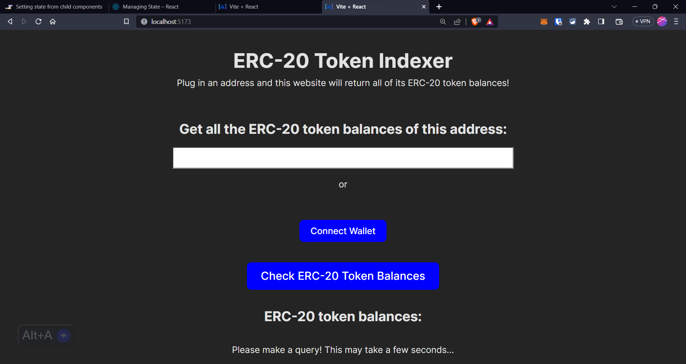

# Simple ERC-20 Indexer

This is an app that uses the Alchemy SDK rigged to Alchemy's Enhanced APIs in order to display all of an address's ERC-20 token balances.

## Set Up

1. Install dependencies by running `npm install`
2. Start the application by running `npm run dev`

## ScreenShots

---

---

---

---

